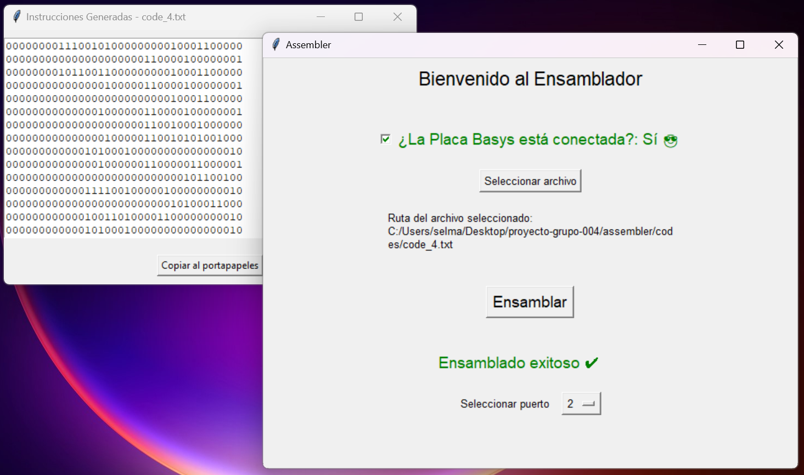

# Assembler

The Assembler is an executable program written in Python that enables the translation of Assembly code into machine code for the Basys3 board.

<!-- image -->
<p align="center">
  
</p>

## Introduction

The assembler code should be able to translate a program written in the assembly language of the project into its machine code implementation.

## Functionality

The program should receive the location of a .txt format file containing an assembly language program for the project. It should then translate it into machine code for the ROM. Subsequently, using the Basys3's serial port, it will program the ROM.

## Usage

Double click on the executable file (`Assembler.exe`), located in `dist` directory. It will ask for the location of the .txt file containing the assembly language program. Finally, it will program the ROM.

## Install packages

Run the following command to install the packages needed to run the program

```bash
pip install -r requirements.txt
```

## Create executable file

If you modify the .spec file run the following command to build the executable again

```bash
pyinstaller assembler.spec
```

Aditional configurations that I used in the .spec file

```diff
block_cipher = None


a = Analysis(
    ['assembler.py'],
    pathex=[],
    binaries=[],
    datas=[],
    hiddenimports=[],
    hookspath=[],
    hooksconfig={},
    runtime_hooks=[],
    excludes=[],
    win_no_prefer_redirects=False,
    win_private_assemblies=False,
    cipher=block_cipher,
    noarchive=False,
)
pyz = PYZ(a.pure, a.zipped_data, cipher=block_cipher)

exe = EXE(
    pyz,
    a.scripts,
    a.binaries,
    a.zipfiles,
    a.datas,
    [],
+   name='Assembler',                   # Name of the executable file
    debug=False,
    bootloader_ignore_signals=False,
    strip=False,
    upx=True,
    upx_exclude=[],
    runtime_tmpdir=None,
+   console=False,                      # To desable the console
    disable_windowed_traceback=False,
    argv_emulation=False,
    target_arch=None,
    codesign_identity=None,
    entitlements_file=None,
+   icon='images/icon.ico',                    # Icon of the executable file
)
```

If you want to create the .spec file again run the following command

```bash
pyinstaller --onefile assembler.py
```
